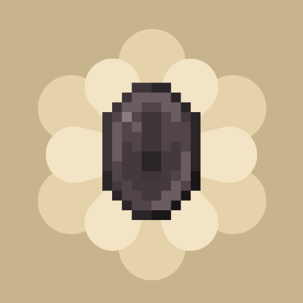

<p align="center">
  
</p>

# Numismatic Reimagined

[](https://github.com/Gaspard4i/numismatic-reimagined/actions/workflows/build.yml)
[](LICENSE)
[](https://www.minecraft.net/)
[](https://docs.architectury.dev/)

Système de monnaie complet pour Minecraft 1.20.1 — bronze, argent, or, netherite, et la mythique star coin. Tirelires, boutiques de joueurs, marketplace.

## Caractéristiques

- **5 dénominations** : Bronze (1) → Silver (100) → Gold (10 000) → Netherite (1 000 000) → Star Coin (trophée)
- **Money bags** : sacs auto-tier qui changent d'apparence selon la valeur
- **Purse** : portefeuille virtuel persistant, accessible via `/numismatic balance`
- **Tirelires** : 3 variantes (base, dorée, netherite) avec capacités croissantes
- **Boutiques de joueurs** : place un shop, configure des offres, encaisse les ventes
- **Boutiques admin** : stock infini, OP-only, compatible LuckPerms
- **Multi-loader** : Fabric + Forge via Architectury

## Installation

1. Installer [Architectury API](https://www.curseforge.com/minecraft/mc-mods/architectury-api)
2. Sur Fabric : installer aussi [Fabric API](https://www.curseforge.com/minecraft/mc-mods/fabric-api)
3. Télécharger le mod et placer le `.jar` dans `mods/`

## Build local

```bash
./gradlew build              # build complet (common + fabric + forge)
./gradlew test               # tests unitaires
./gradlew jacocoTestReport   # rapport de couverture
./gradlew :fabric:runClient  # lancer un client Fabric de dev
./gradlew :forge:runClient   # lancer un client Forge de dev
```

Java 17 requis. JDK Microsoft 17+ recommandé.

## Architecture

- `common/` — code partagé (~70%), neutre vis-à-vis du loader
- `fabric/` — entrypoint, mixins, intégration Fabric
- `forge/` — entrypoint, mixins, intégration Forge
- Tests unitaires JUnit 5 + Mockito + JaCoCo (seuil 96% enforcement)

## Crédits

Inspiré et basé sur :

- [Numismatic Overhaul](https://github.com/wisp-forest/numismatic-overhaul) (Fabric, MIT) par wisp-forest
- [Numismatic Overhaul Reforged Again](https://github.com/seymourimadeit/numismatic-overhaul-reforged-again) (Forge, MIT) par seymourimadeit

## License

[MIT](LICENSE).
