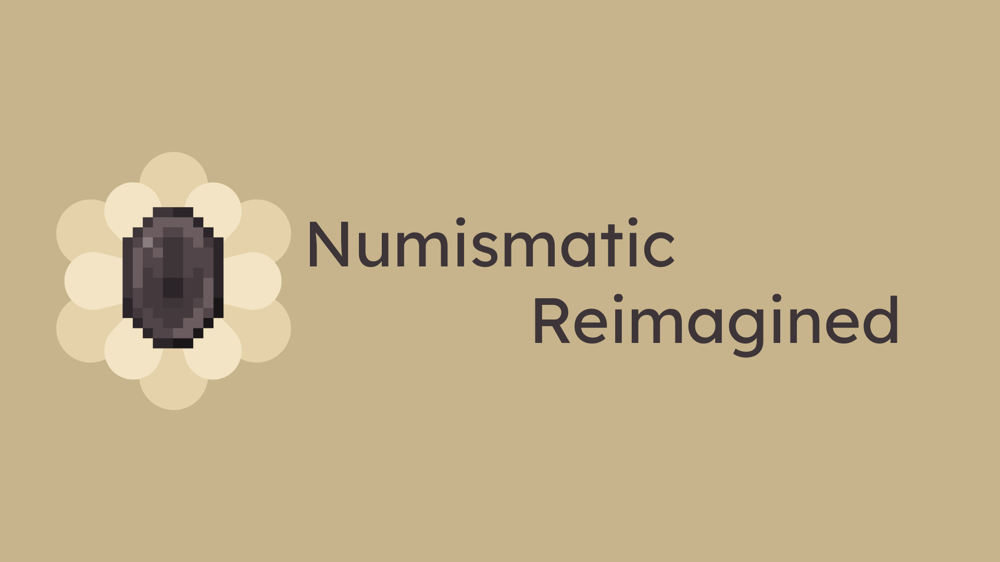

<p align="center">
  
</p>

# Numismatic Reimagined

[](https://github.com/Gaspard4i/numismatic-reimagined/actions/workflows/build.yml)
[](LICENSE)
[](https://www.minecraft.net/)
[](https://docs.architectury.dev/)

Système de monnaie complet pour Minecraft 1.20.1 — bronze, argent, or, netherite, et la mythique star coin. Tirelires, boutiques de joueurs, marketplace.

## Caractéristiques

- **5 dénominations** : Bronze (1) → Silver (100) → Gold (10 000) → Netherite (1 000 000) → Star Coin (trophée)
- **Money bags** : sacs auto-tier qui changent d'apparence selon la valeur. Click-gauche pour absorber pièces/bag, click-droit pour extraire une pile.
- **Purse** : portefeuille virtuel persistant. Touche **P** pour ouvrir le popup d'extraction (+/- par dénom, shift = ±10). HUD icône en haut à droite dans les inventaires.
- **Tirelires directionnelles** : 3 variantes (base, dorée, netherite), hitbox sculptée avec fente rotée selon l'orientation.
- **Boutiques joueur 5 tiers** : bronze (9 slots, 3 offres) → netherite (36 slots, 24 offres). Recipes progressives (chaque tier upgrade le précédent avec la monnaie correspondante).
- **Boutique admin** : stock infini, OP-only.
- **Hopper input** : toggle `H: ON/OFF` dans l'UI owner. Whitelist : seul ce qui matche une offre existante peut entrer.
- **Tooltips icônes** : coins et money bags affichent leur décomposition par icône (pas "1N 2G 3S").
- **Request Board** (reverse shop) : post des demandes d'items, prefundées, paiement automatique aux livreurs. Support NBT strict + items uniques (durabilité max).
- **Advancement Star Coin** : accumuler 1 000 Netherite Coins (= 1 milliard de bronze cumulé) dans la purse déclenche l'advancement et donne une Star Coin.
- **Multi-loader** : Fabric + Forge via Architectury

## Installation

1. Installer [Architectury API](https://www.curseforge.com/minecraft/mc-mods/architectury-api)
2. Sur Fabric : installer aussi [Fabric API](https://www.curseforge.com/minecraft/mc-mods/fabric-api)
3. Télécharger le mod et placer le `.jar` dans `mods/`

## Build local

```bash
./gradlew build              # build complet (common + fabric + forge)
./gradlew test               # tests unitaires
./gradlew jacocoTestReport   # rapport de couverture
./gradlew :fabric:runClient  # lancer un client Fabric de dev
./gradlew :forge:runClient   # lancer un client Forge de dev
```

Java 17 requis. JDK Microsoft 17+ recommandé.

## Architecture

- `common/` — code partagé (~70%), neutre vis-à-vis du loader
- `fabric/` — entrypoint, mixins, intégration Fabric
- `forge/` — entrypoint, mixins, intégration Forge
- Tests unitaires JUnit 5 + Mockito + JaCoCo (seuil 96% enforcement)

## Compatibilité

- **JEI / REI / EMI** : les recipes de crafting (shops, piggy banks, request board)
  utilisent `minecraft:crafting_shaped` vanilla et sont donc auto-détectées par
  tous les plugins de recipe viewer majeurs. Pas de category custom, pas de
  plugin à installer.
- **Items tiers** : les shops et le request board acceptent n'importe quel item
  de n'importe quel mod (tout passe par `ItemStack.isSameItemSameTags` de
  vanilla). Mode "strict NBT" disponible pour les items uniques/enchantés.
- **Forge + Fabric** : aucune différence fonctionnelle. Les items, leurs NBT,
  le mécanisme d'achat/vente, la money bag, tout marche identiquement sur les
  deux loaders via Architectury API 9.x.

## Crédits

Inspiré et basé sur :

- [Numismatic Overhaul](https://github.com/wisp-forest/numismatic-overhaul) (Fabric, MIT) par wisp-forest
- [Numismatic Overhaul Reforged Again](https://github.com/seymourimadeit/numismatic-overhaul-reforged-again) (Forge, MIT) par seymourimadeit

## License

[MIT](LICENSE).
